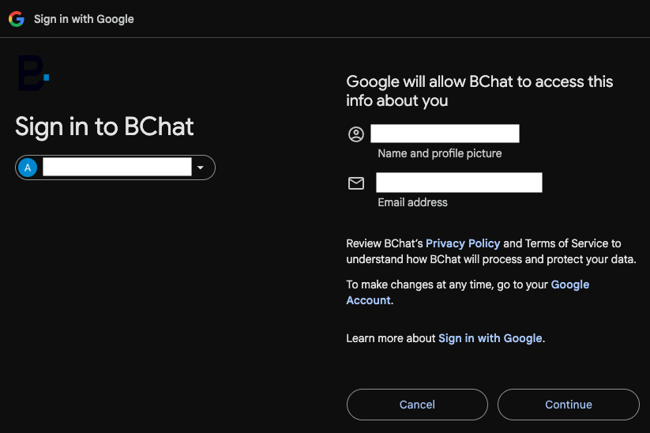
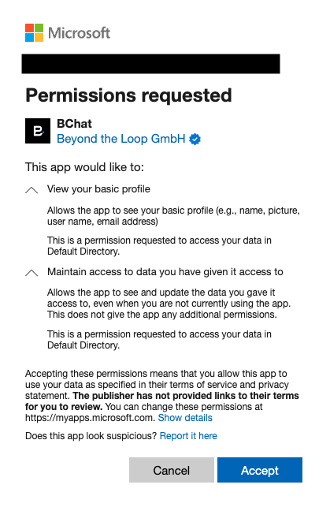
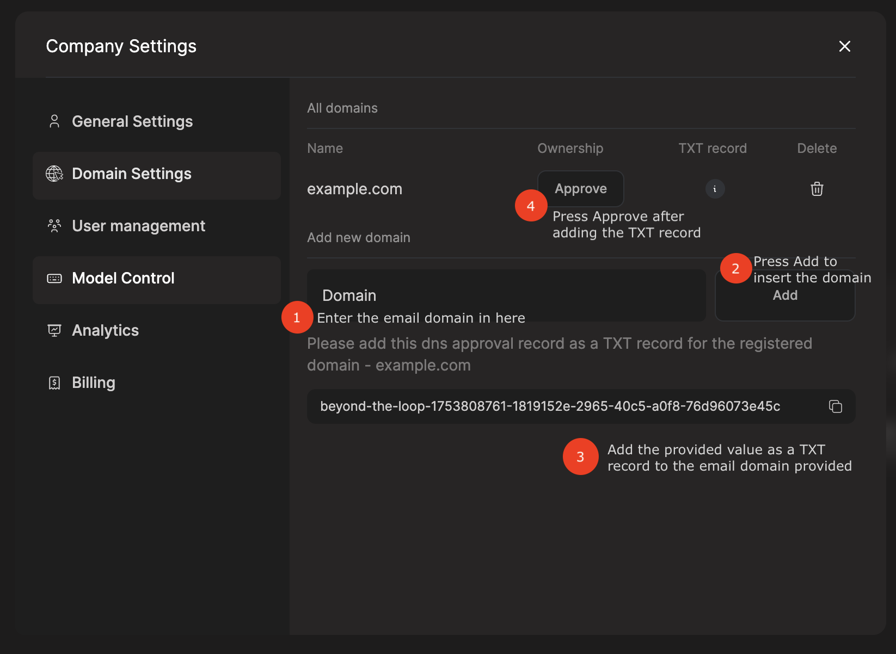

# Single Sign-On (SSO) Configuration

This document provides comprehensive instructions for configuring and using Single Sign-On (SSO) with BChat.
SSO integration is available for organizations using Google Workspace or Microsoft Entra ID.

## Identity Provider Configuration

### Google Workspace SSO

For organizations using Google Workspace, follow these steps to log in:

1. On the BChat login page, click the **Continue with Google** button.
2. Review and accept the permissions requested by the application:
   - Access to your name, profile picture, and email address

### Microsoft Entra ID (Azure AD) SSO

**Administrator Setup Required:**

Before users can log in with Microsoft SSO, a Microsoft tenant administrator must configure the application in Azure Active Directory:

1. Sign in to the Azure portal with your administrator account.
2. Navigate to **Enterprise applications** > **Consent and permissions**.
3. Select **Allow user consent for apps from verified publishers for selected permissions**.

**User Login Process:**

Once configured by an administrator, users can log in as follows:

1. On the BChat login page, click the **Continue with Microsoft** button.
2. Review and accept the permissions requested by the application:
   - Access to your name, profile picture, and email address

## Configure Domain Settings in BChat (Optional)

To enable automatic assignment of users to your company when they sign up with SSO, you can verify your organization's email domain in BChat:

1. Log in to BChat using an admin account.
2. Navigate to **Company Settings**.
3. Click on **Domain Settings**.
4. Enter your organization's email domain in the **Domain** field and click **Add**.
   1. A verification code will appear that must be added to your DNS as a TXT record.
   2. After adding the DNS record, wait for propagation, then click **Approve**.

**Note:** This step is optional for SSO login functionality. However, without domain verification, users with your organization's email domain will not be automatically assigned to your company and will need to be manually invited and assigned by an administrator.

